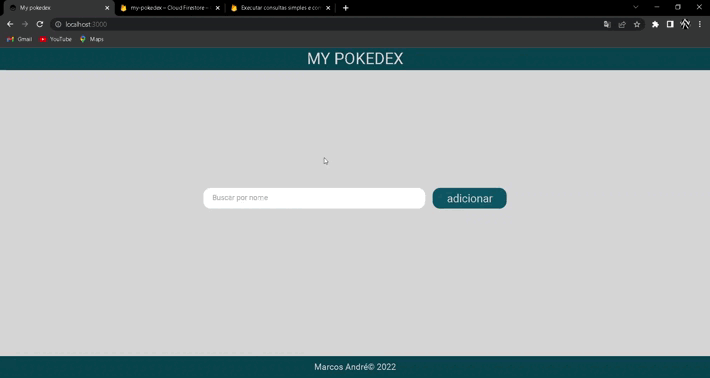
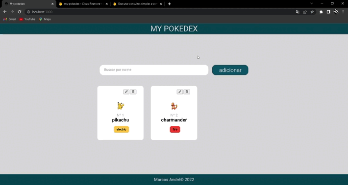
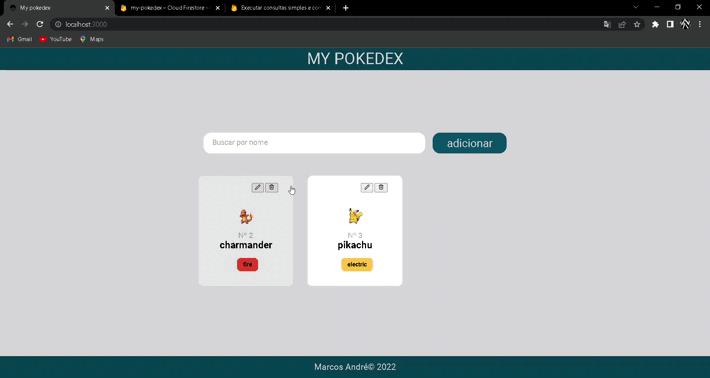

<div align="center">
  <h1>Adição </h1>
	
  <h1>Edição</h1>
  
  <h1>Exclusão</h1>
  
</div>

## :dart: Objetivo

My pokedex é um protótipo para um futuro projeto que envolve reconhecimento através de imagens.

## :hammer_and_wrench: Ferramentas

- [axios](https://axios-http.com/ptbr/docs/intro)
- [react](https://pt-br.reactjs.org/)
- [react-router-dom](https://www.npmjs.com/package/react-router-dom)
- [sass](https://sass-lang.com/)
- [typescript](https://www.typescriptlang.org/)
- [poke-api](https://pokeapi.co/)

## :desktop_computer: Padronização de código

- [Eslint](https://eslint.org/)
- [Prettier](https://prettier.io/)
- [EditorConfig](https://editorconfig.org/)

## :rocket: Executando o projeto

```bash
// Instale as dependências

yarn install

// Concluindo a instalação rode

yarn start
```
